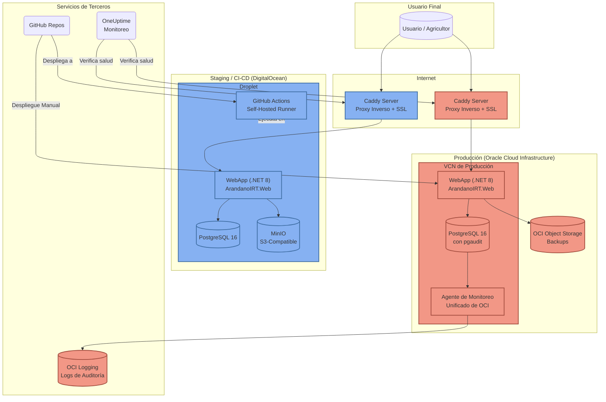

```mermaid
graph TD
    subgraph "Usuario Final"
        U[("Usuario / Agricultor")]
    end

    subgraph "Internet"
        Caddy_Prod[Caddy Server <br> Proxy Inverso + SSL]
        Caddy_Staging[Caddy Server <br> Proxy Inverso + SSL]
    end

    subgraph "Producción (Oracle Cloud Infrastructure)"
        direction LR
        subgraph VCN_Prod [VCN de Producción]
            direction TB
            WebApp_Prod["WebApp (.NET 8) <br> ArandanoIRT.Web"]
            PostgreSQL_Prod[("PostgreSQL 16 <br> con pgaudit")]
            OCI_Agent["Agente de Monitoreo <br> Unificado de OCI"]
        end
        ObjectStorage_Prod[("OCI Object Storage <br> Backups")]
    end

    subgraph "Staging / CI-CD (DigitalOcean)"
        direction LR
        subgraph Droplet_Staging [Droplet]
            direction TB
            WebApp_Staging["WebApp (.NET 8) <br> ArandanoIRT.Web"]
            PostgreSQL_Staging[("PostgreSQL 16")]
            MinIO_Staging[("MinIO <br> S3-Compatible")]
            Runner[GitHub Actions <br> Self-Hosted Runner]
        end
    end

    subgraph "Servicios de Terceros"
        GitHub(GitHub Repos)
        OneUptime(OneUptime <br> Monitoreo)
        OCI_Logging[("OCI Logging <br> Logs de Auditoría")]
    end

    %% Conexiones
    U --> Caddy_Prod
    U --> Caddy_Staging

    Caddy_Prod --> WebApp_Prod
    WebApp_Prod --> PostgreSQL_Prod
    WebApp_Prod --> ObjectStorage_Prod
    PostgreSQL_Prod --> OCI_Agent
    OCI_Agent --> OCI_Logging

    Caddy_Staging --> WebApp_Staging
    WebApp_Staging --> PostgreSQL_Staging
    WebApp_Staging --> MinIO_Staging

    GitHub --"Despliega a"--> Runner
    Runner --"Ejecuta en"--> Droplet_Staging
    GitHub --"Despliegue Manual"--> WebApp_Prod

    OneUptime --"Verifica salud"--> Caddy_Prod
    OneUptime --"Verifica salud"--> Caddy_Staging


    classDef oci fill:#f29786,stroke:#a14b3d,stroke-width:2px;
    classDef do fill:#86b1f2,stroke:#3d6ca1,stroke-width:2px;
    class Caddy_Prod,WebApp_Prod,PostgreSQL_Prod,ObjectStorage_Prod,OCI_Agent,VCN_Prod,OCI_Logging oci
    class Caddy_Staging,WebApp_Staging,PostgreSQL_Staging,MinIO_Staging,Runner,Droplet_Staging do
```