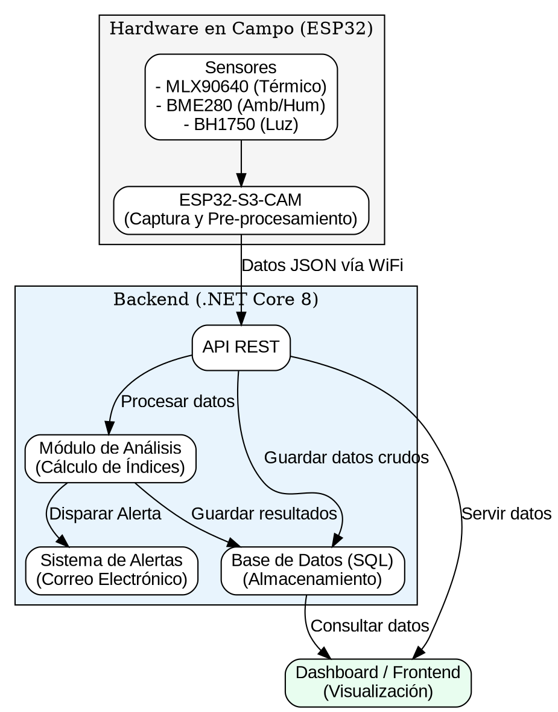
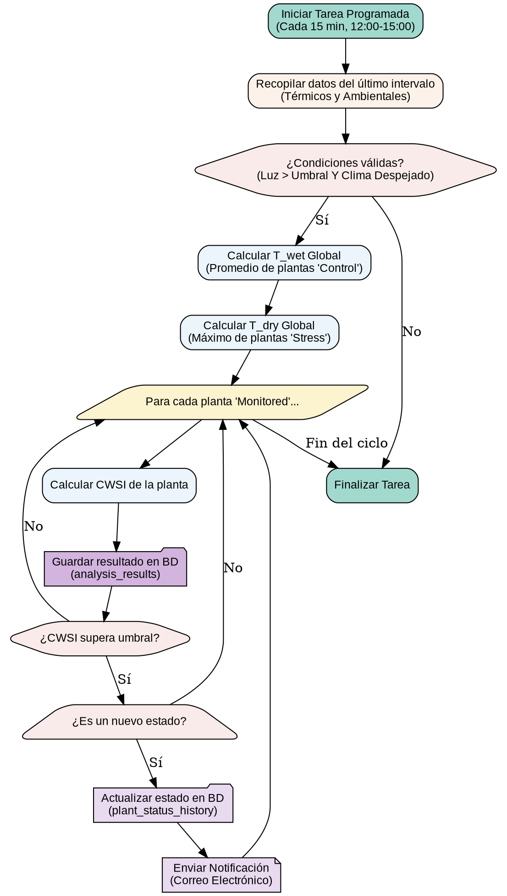
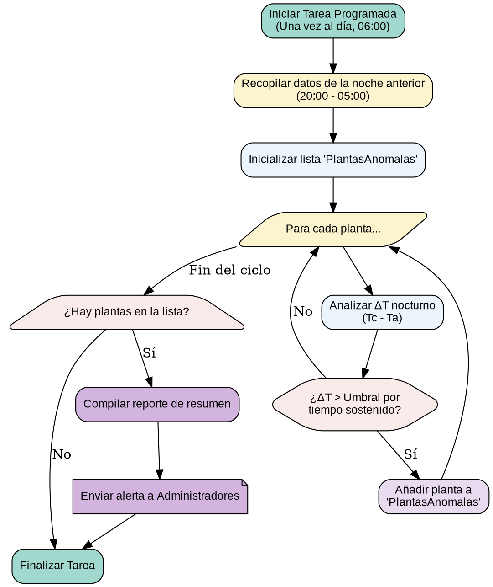

# Diseño e Implementación del Módulo de Análisis y Alertas de Estrés Hídrico

**Versión:** 1.1

**Fecha:** 21 de julio de 2025

---
## 1. Introducción y Objetivo

Este documento detalla el diseño técnico y la lógica de implementación para el **Módulo de Análisis y Alertas de Estrés Hídrico**, un componente central del "Sistema para la Detección de Estrés Hídrico en el Arándano Biloxi Mediante Termografía de Bajo Costo".

El **objetivo principal** de este módulo es procesar de manera automatizada los datos termográficos y ambientales recopilados por el hardware en campo para transformarlos en información accionable. Específicamente, el módulo se encargará de:

* Diagnosticar el estado hídrico de cada planta de arándano de forma individual.
* Generar alertas oportunas y diferenciadas según el nivel de estrés detectado.
* Producir reportes detallados que apoyen la toma de decisiones para una gestión hídrica eficiente y sostenible.

La implementación se basará en principios fisiológicos validados científicamente y seguirá una arquitectura de software robusta, eficiente y mantenible.

### 1.1. Flujo de Datos del Sistema

El sistema sigue una arquitectura distribuida donde el hardware en campo se encarga de la captura, y un servidor centralizado (backend) realiza el procesamiento, análisis y almacenamiento. El flujo de datos se visualiza en el siguiente diagrama.



---

## 2. Arquitectura General y Lógica de Análisis

### 2.1. Estrategia: Análisis Dual Mediante Tareas Programadas

El sistema no analiza cada dato en el instante en que llega a la base de datos. Para garantizar la eficiencia y el rigor científico, se implementa una **estrategia de análisis dual** que opera a través de dos tareas programadas (`background jobs`) independientes y especializadas:

1.  Un proceso de alta frecuencia durante el día, enfocado exclusivamente en la **detección de estrés hídrico**.
2.  Un proceso de baja frecuencia (diario), enfocado en la **detección de comportamientos térmicos anómalos**, principalmente nocturnos.

Este enfoque desacopla el análisis de las peticiones de los usuarios, previene la sobrecarga del sistema y permite aplicar la lógica científica correcta en el momento adecuado.


### 2.2. Proceso 1: Análisis y Alerta de Estrés Hídrico (Diurno)

Esta es la tarea principal del módulo. Su objetivo es calcular el CWSI y determinar el estado hídrico de las plantas en tiempo casi real durante el período de máxima relevancia fisiológica.

* **Disparador (Trigger):** La tarea se ejecuta cada 15 minutos, pero únicamente dentro de la ventana horaria de **12:00 a 15:00**.
* **Proceso:** Al activarse, la tarea recopila los datos del último intervalo, valida las condiciones ambientales, calcula las líneas base dinámicas ($T_{wet}$ y $T_{dry}$), determina el CWSI de cada planta y, si detecta un cambio de estado (ej. de 'Normal' a 'Estrés Incipiente'), actualiza la base de datos y envía la alerta correspondiente.

#### 2.2.1. Diagrama de Flujo del Proceso Diurno




### 2.3. Proceso 2: Análisis y Alerta de Comportamiento Anómalo (Nocturno)

Esta tarea actúa como un sistema de vigilancia para detectar patrones que no corresponden al modelo de estrés hídrico y que podrían indicar otros problemas (ej. bióticos).

  * **Disparador (Trigger):** La tarea se ejecuta **una vez al día**, temprano en la mañana (ej. 06:00).
  * **Proceso:** La tarea recopila todos los datos de la noche anterior. Itera sobre cada planta buscando patrones anómalos, como una temperatura de canopia significativamente superior a la del ambiente durante un tiempo prolongado. Si encuentra anomalías, no las clasifica como estrés hídrico, sino que compila un único reporte de resumen y lo envía a los administradores para que realicen una inspección visual.

#### 2.3.1. Diagrama de Flujo del Proceso Nocturno


---

## 3. Decisiones Clave de Diseño

Esta sección documenta las respuestas a las preguntas fundamentales que definieron la arquitectura del módulo, justificando las elecciones técnicas y científicas.

### 3.1. ¿Cómo se determinarán las líneas base?

La determinación de las líneas base ($T_{wet}$ y $T_{dry}$), cruciales para el cálculo del CWSI, se realizará de forma **dinámica y global en cada ciclo de análisis**, y no se almacenarán como valores históricos en la base de datos.

* **Justificación:** Este enfoque es científicamente necesario para garantizar la validez del CWSI, ya que el índice debe normalizar la temperatura de una planta en función de las condiciones ambientales exactas de ese momento. El uso de referencias vivas que responden en tiempo real a las mismas condiciones es la metodología validada en la literatura.
* **Implementación:**
    * **Línea Base Húmeda ($T_{wet}$):** Se calculará en tiempo real promediando la temperatura de la canopia (`Tc`) de todas las plantas asignadas al grupo **'Control'**.
    * **Línea Base Seca ($T_{dry}$):** Se determinará identificando la `Tc` máxima entre todas las plantas asignadas al grupo **'Stress'**.

### 3.2. ¿Cómo se mitigarán los falsos positivos?

Se implementará una **estrategia de tres capas** para asegurar que las alertas de "Estrés Hídrico" sean lo más fiables posible, diferenciando el estrés hídrico de otras condiciones abióticas y bióticas.

1.  **Filtrado Riguroso de Datos:** El sistema solo analizará datos que cumplan con condiciones estrictas de validez: horario de máxima radiación (12:00-15:00), alta intensidad lumínica y condiciones climáticas despejadas, descartando datos de días lluviosos o muy nublados que invalidan la medición.
2.  **Normalización con Grupo de Control:** El uso de plantas de **'Control'** permite al sistema tener una referencia en tiempo real de una planta sana bajo las mismas condiciones ambientales. Esto anula el efecto de variables abióticas (como un viento cálido), ya que tanto las plantas monitoreadas como las de control se verían afectadas, evitando así falsas alarmas.
3.  **Estado de "Comportamiento Anómalo":** Para gestionar posibles causas bióticas, cualquier aumento de temperatura significativo detectado **fuera de la ventana de análisis diurno** no se clasificará como estrés hídrico. En su lugar, se asignará el estado "Comportamiento Térmico Anómalo", sugiriendo al usuario una inspección visual para buscar otras causas como patógenos o plagas.

### 3.3. ¿Se requiere IA/ML para generar las alertas?

**No**. Para los objetivos de este proyecto, un **algoritmo lógico basado en el CWSI es suficiente y superior**.

* **Justificación:** El enfoque algorítmico es preferible por su **explicabilidad científica**, permitiendo justificar cada alerta con una causa fisiológica directa y umbrales validados. Además, los **requisitos de datos son manejables** dentro del alcance de una tesis, a diferencia de los modelos de IA/ML, que exigirían un dataset masivo y etiquetado por expertos. Finalmente, es una solución **computacionalmente eficiente** y alineada con el enfoque de bajo costo del proyecto. La IA/ML se documentará como una vía para futuros trabajos de investigación.

### 3.4. Lógica de Clasificación y Alertas

El sistema utilizará la siguiente tabla de reglas para clasificar el estado de la planta y determinar la acción correspondiente. El **CWSI será el indicador primario** debido a su robustez y normalización frente a las condiciones ambientales.

| Condición (Umbral CWSI) | Estado Asignado         | Justificación Científica                                                                                                                                                             | Acción del Sistema (Backend)                                                                                                                                        |
| :---------------------- | :---------------------- | :----------------------------------------------------------------------------------------------------------------------------------------------------------------------------------- | :------------------------------------------------------------------------------------------------------------------------------------------------------------------ |
| `CWSI <= 0.3`           | **Normal** | La literatura establece este rango como representativo de un buen estado hídrico en frutales, donde el crecimiento no se ve afectado (Quezada et al., 2020).                             | 1. Registrar el estado "Normal". <br> 2. No generar ninguna alerta.                                                                                              |
| `0.3 < CWSI <= 0.5`     | **Estrés Incipiente** | Este rango intermedio indica una transición hacia un estrés moderado. Superar el umbral de 0.3 ya implica una reducción en la tasa de crecimiento, justificando una alerta temprana. | 1. Registrar el estado "Estrés Incipiente". <br> 2. Generar una **Alerta de Nivel 1** con el mensaje: "Alerta: Estrés hídrico incipiente detectado. Valor CWSI: [valor]". |
| `CWSI > 0.5`            | **Estrés Crítico** | Valores superiores a 0.5 indican un cierre estomático significativo. En estudios de campo, los tratamientos sin riego en frutales alcanzan valores de CWSI de hasta 0.91 (Quezada et al., 2020). | 1. Registrar el estado "Estrés Crítico". <br> 2. Generar una **Alerta de Nivel 2 (Crítica)** con alta prioridad, incluyendo un enlace directo al historial del evento.      |

---

## 4. Configuración y Parámetros del Módulo

Para asegurar la flexibilidad y mantenibilidad del sistema, los parámetros clave que gobiernan la lógica de análisis no estarán fijos en el código. En su lugar, se gestionarán a través de un sistema de configuración jerárquico y editable.

### 4.1. Lógica de Configuración Jerárquica

El sistema utilizará una estrategia de configuración de dos niveles para obtener los parámetros de análisis:

1.  **Nivel 1 (Base de Datos):** La fuente principal de configuración será el campo `crop_settings` (JSONB) en la tabla `crops`. Esto permite que un administrador modifique los parámetros para un cultivo específico directamente desde una interfaz de usuario, sin necesidad de redesplegar la aplicación.
2.  **Nivel 2 (Archivo de Configuración):** El archivo `appsettings.json` contendrá un conjunto de valores predeterminados (defaults) para todos los parámetros.

El flujo de obtención de un parámetro será: el sistema primero intentará leer el valor desde la base de datos. Si el campo `crop_settings` es nulo o no contiene la clave específica, el sistema utilizará automáticamente el valor predeterminado del archivo `appsettings.json`.

### 4.2. Estructura del JSONB `crop_settings`

El campo `crop_settings` almacenará todos los parámetros críticos en una estructura JSON flexible. A continuación, se muestra un ejemplo de la estructura con los valores predeterminados recomendados.

```json
{
  "analysis_parameters": {
    "cwsi_threshold_incipient": 0.3,
    "cwsi_threshold_critical": 0.5,
    "analysis_window_start_hour": 12,
    "analysis_window_end_hour": 15,
    "light_intensity_threshold": 600
  },
  "anomaly_parameters": {
    "delta_t_threshold": 1.5,
    "duration_minutes": 30
  },
  "calibration_reminder": {
    "reminder_interval_months": 3
  }
}
```

  * **`analysis_parameters`**: Contiene los umbrales para el análisis de estrés hídrico diurno.
      * `cwsi_threshold_incipient`: Valor de CWSI para activar la alerta de "Estrés Incipiente".
      * `cwsi_threshold_critical`: Valor de CWSI para activar la alerta de "Estrés Crítico".
      * `analysis_window_start_hour` / `end_hour`: Define la ventana horaria (formato 24h) para el análisis.
      * `light_intensity_threshold`: Umbral mínimo de irradiancia para considerar válidos los datos.
  * **`anomaly_parameters`**: Contiene los umbrales para la detección de anomalías nocturnas.
      * `delta_t_threshold`: Diferencia de temperatura ($T_c - T_a$) en °C que debe superarse.
      * `duration_minutes`: Tiempo mínimo que debe persistir la anomalía para ser reportada.
  * **`calibration_reminder`**: Gestiona el recordatorio de calibración.
      * `reminder_interval_months`: Frecuencia en meses para enviar el recordatorio.
---

## 5. Estrategias de Robustez y Experiencia de Usuario

Para asegurar que el sistema no solo sea funcional sino también fiable y útil a largo plazo, se implementarán estrategias específicas para garantizar la calidad de los datos y mejorar la experiencia del usuario final.

### 5.1. Integridad y Calidad de los Datos

El sistema operará bajo un principio de escepticismo, validando activamente la calidad de los datos antes de realizar cualquier análisis.

* **Validación de Datos en el Backend:** Se implementará una capa de validación en el backend que interceptará todos los datos entrantes de los sensores. Cada registro será verificado contra rangos plausibles (ej., humedad relativa entre 0-100%, temperaturas ambientales acordes al clima local). Los datos que no cumplan con esta validación serán marcados como "inválidos" y excluidos de todos los cálculos de análisis para no contaminar los resultados.

* **Manejo de Datos Faltantes de Referencia:** Si en una ventana de análisis diurno, el sistema detecta que faltan datos de una o más de las plantas de referencia (`Control` o `Stress`), el cálculo del CWSI para ese intervalo **será suspendido**. En su lugar, se generará una alerta de sistema dirigida exclusivamente a los administradores, notificando la falla del sensor de referencia. Esta medida previene la generación de diagnósticos erróneos basados en datos incompletos.

* **Protocolo de Calibración Asistido por Software:** Para mitigar la "deriva" de los sensores a largo plazo, el sistema asistirá en el protocolo de calibración. Una tarea programada verificará la fecha almacenada en `crop_settings.calibration_reminder.last_calibration_date`. Si han transcurrido más de los meses definidos en `reminder_interval_months` (por defecto 3), el sistema enviará automáticamente un correo electrónico a todos los administradores recordándoles la necesidad de realizar una calibración manual de los sensores.

### 5.2. Trazabilidad de Alertas

Para que las notificaciones sean verdaderamente accionables, deben conectar al usuario directamente con la evidencia que las generó.

* **Enlaces Directos en Notificaciones:** Cada correo electrónico de alerta (tanto de "Estrés Hídrico" como de "Comportamiento Anómalo") contendrá un **enlace directo y único**. Al hacer clic en este enlace, el usuario será dirigido a la página de la planta correspondiente dentro de la aplicación, donde el historial de estados (`plant_status_history`) aparecerá automáticamente filtrado para mostrar el evento específico que disparó la alerta. Esta funcionalidad conecta la notificación con su contexto de forma inmediata, facilitando una investigación y toma de decisiones rápida.

---


## 6. Especificaciones del Reporte de Estado Hídrico

El reporte es el producto final tangible que entrega el sistema al usuario. Para garantizar un rendimiento óptimo, **toda la información del reporte se genera a partir de consultas a la tabla `analysis_results`**, que contiene los datos ya procesados y almacenados por las tareas de análisis. Su diseño está pensado para ser útil en tres niveles: diagnóstico rápido, análisis de tendencias y auditoría de datos.

### 6.1. Encabezado e Identificación

Todo reporte comenzará con una sección de encabezado clara que identifique:

* **Título del Reporte:** "Reporte de Estado Hídrico"
* **Nombre/ID de la Planta:** `{{ plant.name }}`
* **Cultivo:** `{{ crop.name }}`
* **Periodo de Evaluación:** Rango de fechas seleccionado.
* **Fecha de Generación:** Fecha y hora en que se creó el reporte.

### 6.2. Sección 1: Resumen Ejecutivo y Diagnóstico

Esta sección proporciona una visión general e inmediata del estado de la planta, diseñada para una toma de decisiones rápida.

* **Diagnóstico General:** Un texto claro que resuma el estado (ej., "Óptimo", "Tendencia a Estrés Leve", "Estrés Crítico Detectado").
* **Indicadores Clave:**
    * **CWSI Promedio:** El valor medio del CWSI durante el período.
    * **CWSI Máximo Registrado:** El pico de estrés detectado.
* **Conteo de Alertas:**
    * **Total de Alertas de Estrés Incipiente:** Número de veces que el estado cambió a "Estrés Incipiente".
    * **Total de Alertas de Estrés Crítico:** Número de veces que el estado cambió a "Estrés Crítico".
    * **Total de Anomalías Nocturnas:** Número de noches en las que se detectó un comportamiento anómalo.

### 6.3. Sección 2: Análisis Visual de Evolución

Esta sección contiene el gráfico principal para entender el comportamiento de la planta en el tiempo y su relación con el ambiente.

* **Gráfico de Series de Tiempo:**
    * **Eje X:** Línea de tiempo (Días/Horas).
    * **Eje Y Principal (CWSI):** Una línea destacada mostrando la evolución del **CWSI**.
    * **Líneas de Umbral:** Dos líneas de referencia horizontales que marcan los umbrales de **Estrés Incipiente (0.3)** y **Estrés Crítico (0.5)** para una fácil interpretación visual.
    * **Eje Y Secundario (Temperatura °C):** Dos líneas secundarias mostrando la **Temperatura de Canopia ($T_c$)** y la **Temperatura Ambiente ($T_a$)** para dar contexto.

### 6.4. Sección 3: Datos de Contexto y Auditoría

Esta sección final proporciona los datos detallados para un análisis más profundo.

* **Tabla de Eventos Relevantes:** Un listado de los momentos clave del período, incluyendo:
    * Fecha y Hora
    * Evento (ej., "Inicio de Estrés Crítico", "Anomalía Nocturna Detectada")
    * Valor CWSI (si aplica)
    * Datos Ambientales ($T_a$, Humedad, VPD)

* **Historial de Observaciones (Bitácora):** Una transcripción de todas las entradas manuales registradas para esa planta durante el período, permitiendo correlacionar los datos del sensor con las observaciones de campo (ej., "Se realizó riego manual de 2 litros", "Se observan hojas amarillentas en la base").

---

## 7. Cambios Requeridos en el Sistema

Para implementar el módulo de análisis, se requiere un conjunto de modificaciones puntuales y controladas en la base de datos y en la arquitectura del backend. Estos cambios están diseñados para ser implementados de una sola vez, aprovechando la infraestructura existente de la aplicación.

### 7.1. Base de Datos

Se realizarán las siguientes tres modificaciones en el esquema de la base de datos PostgreSQL para dar soporte a la nueva funcionalidad:

1.  **Clasificación de Plantas para el Experimento:** Se añadirá una columna ENUM a la tabla `plants` para identificar el rol de cada planta (Control, Estrés, Monitoreada).
    ```sql
    -- Propósito: Asignar un rol a cada planta para el cálculo de líneas base.
    ALTER TABLE plants 
    ADD COLUMN experimental_group VARCHAR(50) NOT NULL DEFAULT 'Monitored';
    ```

2.  **Almacenamiento de la Máscara Térmica:** Se añadirá la columna propuesta en el diseño técnico original para guardar la máscara de cada planta.
    ```sql
    -- Propósito: Almacenar las coordenadas de la canopia de cada planta.
    ALTER TABLE plants 
    ADD COLUMN thermal_mask_data JSONB NULL;
    ```

3.  **Configuración a Nivel de Cultivo:** Se añadirá una columna a la tabla `crops` para permitir la gestión de parámetros desde la UI.
    ```sql
    -- Propósito: Guardar umbrales y parámetros de análisis editables por el admin.
    ALTER TABLE crops 
    ADD COLUMN crop_settings JSONB NULL;
    ```

4.  **Tabla de Resultados de Análisis:** Se creará una nueva tabla para almacenar los resultados de los análisis, optimizando la generación de reportes.
    ```sql
-- Propósito: Almacenar los resultados calculados por el módulo de análisis para un rendimiento óptimo de los reportes y una completa auditabilidad.
CREATE TABLE public.analysis_results (
    id BIGSERIAL PRIMARY KEY,
    plant_id INT NOT NULL REFERENCES public.plants(id) ON DELETE CASCADE,
    recorded_at TIMESTAMPTZ NOT NULL,
    
    -- Resultado del Análisis
    cwsi_value REAL,
    status plant_status NOT NULL,
    
    -- Datos de Entrada (para contexto y rendimiento)
    canopy_temperature REAL,
    ambient_temperature REAL,
    vpd REAL,
    
    -- Líneas Base Usadas (para auditabilidad y depuración)
    baseline_twet REAL,
    baseline_tdry REAL,

    -- Restricción para evitar duplicados
    UNIQUE(plant_id, recorded_at) 
);

CREATE INDEX idx_analysis_results_plant_id_recorded_at ON public.analysis_results(plant_id, recorded_at DESC);
    ```

### 7.2. Backend

La implementación en el backend se centrará en la creación de nuevos servicios programados y la actualización de la lógica de configuración y la UI.

* **Servicios de Análisis Programados (`IHostedService`):** Es necesario desarrollar tres servicios que se ejecuten en segundo plano:
    * **`WaterStressAnalysisService`:** Se activará cada 15 minutos en la ventana diurna (12:00-15:00) para ejecutar la lógica de cálculo de CWSI y generación de alertas de estrés hídrico.
    * **`AnomalousBehaviorService`:** Se activará una vez al día (06:00) para analizar los datos nocturnos y reportar anomalías térmicas.
    * **`CalibrationReminderService`:** Se activará periódicamente (ej. semanalmente) para verificar la fecha de la última calibración y enviar un recordatorio a los administradores si han pasado más de 3 meses.

* **Lógica de Configuración Jerárquica:** Se debe implementar un servicio que obtenga los parámetros de análisis leyendo primero el campo `crop_settings` de la base de datos y, en caso de no encontrar un valor, utilice el default del archivo `appsettings.json`.

* **Actualización de la Interfaz de Usuario (UI):** La interfaz de administración deberá ser modificada para permitir a los usuarios con permisos:
    * Asignar el `experimental_group` a cada planta en el formulario de edición de plantas.
    * Editar los parámetros de análisis (`crop_settings`) en el formulario de edición de cultivos.
    * Generar máscara termica para cada planta, permitiendo al usuario selecionar las coordenadas de la canopia en una imagen térmica y almacenarlas en la base de datos.

* **Generación de Reportes:** Se debe implementar un servicio que genere los reportes de estado hídrico en formato PDF. Este servicio **consultará directamente la tabla `analysis_results`** para obtener los datos históricos de manera eficiente.

---

## 8. Requerimientos Futuros

Una vez que el módulo principal esté implementado y validado, se abren varias vías para expandir su funcionalidad y potenciar su impacto. Las siguientes ideas se documentan como requerimientos futuros para la evolución del sistema:

* **Diagnóstico Avanzado con Inteligencia Artificial (IA/ML):** Con un volumen de datos históricos suficiente, se podría explorar el uso de modelos de Machine Learning para:
    * **Diferenciar tipos de estrés:** Entrenar un modelo de clasificación que aprenda a distinguir la "firma térmica" del estrés hídrico de otros tipos de estrés, como lo sería el causado por plagas o enfermedades.
    * **Predecir rendimiento:** Utilizar los patrones de estrés a lo largo de una temporada para entrenar un modelo de regresión que pueda predecir el rendimiento final de la cosecha.
    * **Segmentación Automática en Campo Abierto:** Desarrollar un modelo de segmentación de imágenes que pueda identificar automáticamente las plantas en campo abierto, eliminando la necesidad de intervención manual para crear máscaras térmicas.

* **Estrategia de Archivado de Datos a Largo Plazo:** Para garantizar el rendimiento del sistema a lo largo de varios años, se deberá implementar una política de archivado. Esto implicaría mover los datos brutos más pesados (ej., matrices térmicas) a un sistema de almacenamiento en frío (cold storage) después de un cierto período (ej., 2 años), manteniendo los resultados procesados (CWSI, estados) en la base de datos activa para consultas rápidas.

* **Integración con Sistemas de Riego Automatizado:** El siguiente paso lógico para el sistema es cerrar el ciclo de "detección-acción". Se podría desarrollar una API segura que permita a los controladores de riego automatizados consultar el estado hídrico de las plantas y activar el riego de precisión de forma autónoma, basándose en las alertas generadas por el módulo.

* **Dashboards Avanzados y Contextuales:** Se podrían desarrollar interfaces de visualización más ricas, que permitan al usuario explorar los datos de forma interactiva, superponiendo el gráfico de CWSI con variables ambientales clave como el VPD o la radiación solar para un análisis contextual más profundo.
