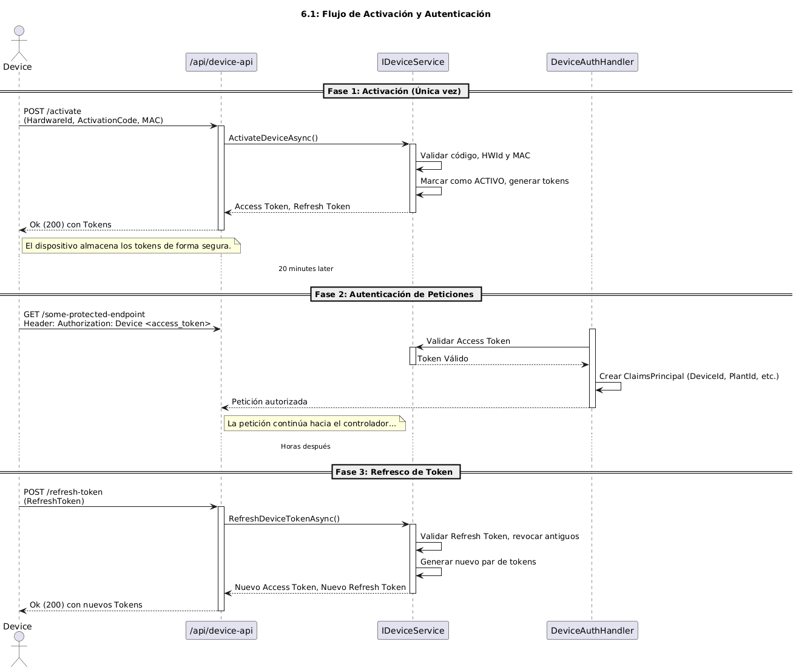
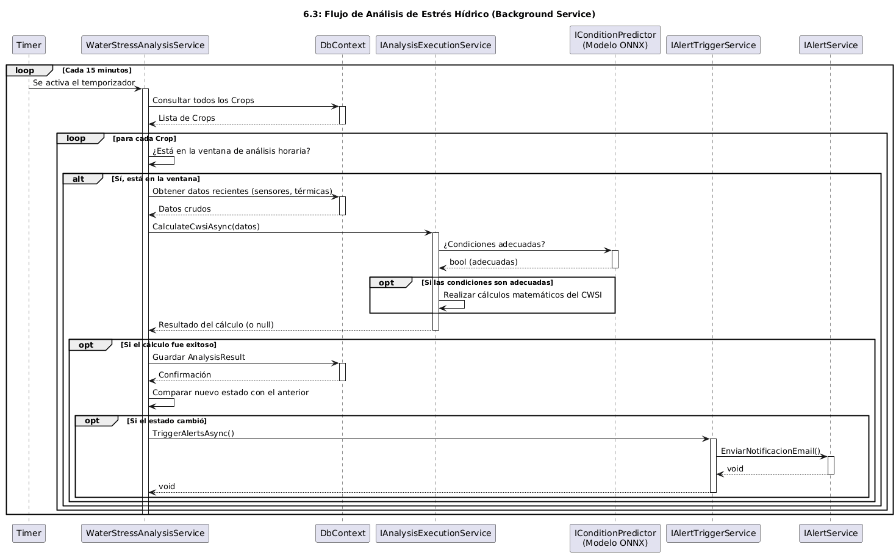
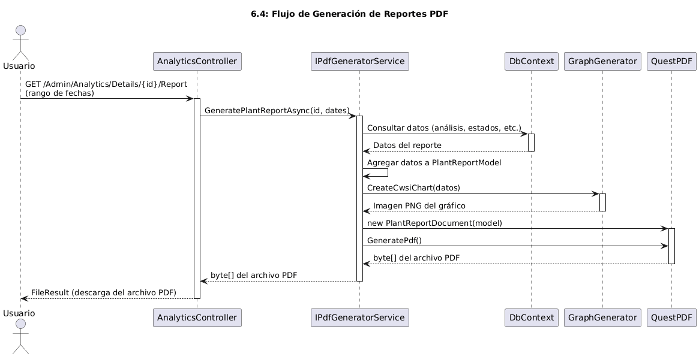

# Manual Técnico: Sistema Arandano IRT

* **Versión del Documento:** 1.0
* **Fecha:** 2025-10-16

---
## Capítulo 1: Introducción

### 1.1 Propósito y Objetivos
Este documento es la guía técnica central para el **Sistema de Detección de Estrés Hídrico en el Arándano Biloxi Mediante Termografía de Bajo Costo**.  Su propósito es proporcionar una visión exhaustiva y detallada de todos los aspectos del sistema, sirviendo como una referencia única para el personal técnico encargado de su desarrollo, despliegue, operación y mantenimiento.

Los objetivos principales de este manual son:
* Presentar de forma clara los **requerimientos funcionales y no funcionales** que dieron origen al sistema. 
* Describir en detalle la **arquitectura de software e infraestructura**, explicando cómo los componentes interactúan entre sí.
* Proporcionar un procedimiento paso a paso para la **instalación, puesta en marcha y configuración** del sistema en un servidor desde cero.
* Documentar las estrategias de **operación continua, monitoreo, copias de seguridad y recuperación** ante desastres.

### 1.2 Alcance del Sistema y del Documento

El sistema de detección es una **aplicación web independiente**  diseñada para ser accedida a través de un navegador estándar desde cualquier dispositivo con conexión a internet.  Su función principal es recolectar, procesar y visualizar datos de cámaras térmicas para generar reportes y notificaciones sobre el estado hídrico de las plantas. 

El correcto funcionamiento del sistema puede verse afectado por diversos factores externos:
* **Condiciones Ambientales:** Cambios climáticos drásticos (lluvia, niebla, viento) pueden alterar la calidad de los datos termográficos. 
* **Factores Tecnológicos:** El sistema depende de una conectividad a internet estable, suministro eléctrico confiable y la compatibilidad del hardware. 
* **Factores Humanos:** Requiere personal capacitado para la correcta instalación y configuración de los dispositivos de monitoreo. 
* **Seguridad y Operación:** Es fundamental garantizar la protección de los datos y la disponibilidad continua del sistema. 

Este manual cubre todo el ciclo de vida técnico del proyecto, pero **no abarca el desarrollo o modificación del código fuente**, para lo cual se deben consultar directamente los comentarios y la estructura del código en el repositorio.

### 1.3 Audiencia

Este documento está dirigido a tres perfiles técnicos principales:

* **Ingenieros de DevOps o Administradores de Sistemas:** Encontrarán aquí las guías para el despliegue de infraestructura, configuración de producción, mantenimiento de backups, recuperación ante desastres y gestión de los pipelines de CI/CD.
* **Desarrolladores de Software:** Utilizarán este manual para comprender la arquitectura del código, la responsabilidad de cada capa y módulo, los flujos de datos clave y cómo el sistema se integra con servicios externos.
* **Personal Técnico de Soporte:** Podrán consultar este documento para entender el funcionamiento general de los componentes del sistema y diagnosticar problemas.

### 1.4 Definiciones, Acrónimos y Abreviaturas

La siguiente tabla define los términos y acrónimos utilizados a lo largo del documento.

| Término | Descripción |
| :--- | :--- |
| **RF** | Requerimiento Funcional.  |
| **RNF** | Requerimiento no Funcional.  |
| **CRUD** | Create (crear), Read (leer), Update (actualizar), Delete (eliminar).  |
| **C#** | Lenguaje de programación principal del backend, basado en objetos y ejecutado sobre .NET.  |
| **HTML/CSS/JS** | Tecnologías estándar para la construcción de la interfaz de usuario web.  |
| **SQL** | Lenguaje de Consulta Estructurado para la gestión de bases de datos relacionales.  |
| **HTTPS** | Protocolo de Transferencia de Hipertexto Seguro, para la comunicación cifrada.  |
| **IaC** | Infraestructura como Código (Infrastructure as Code). |
| **CI/CD** | Integración Continua y Despliegue Continuo (Continuous Integration/Continuous Deployment). |
| **VM** | Máquina Virtual (Virtual Machine). |
| **CWSI** | Índice de Estrés Hídrico del Cultivo (Crop Water Stress Index). |
| **VPD** | Déficit de Presión de Vapor (Vapor Pressure Deficit). |
| **API** | Interfaz de Programación de Aplicaciones (Application Programming Interface). |

---

## Capítulo 2: Arquitectura General del Sistema

### 2.1 Visión General y Filosofía de Diseño
La arquitectura del sistema se fundamenta en principios de **código abierto, infraestructura como código (IaC), portabilidad a través de contenedores y seguridad por diseño**. El proyecto adopta una filosofía **"Open Source Primero"**, buscando maximizar el control, la transparencia y minimizar los costos, lo que se refleja en la elección de 11 de las 14 herramientas de la pila tecnológica (un 78.6%).

Aun así, el enfoque es pragmático e integra estratégicamente servicios privativos de alto rendimiento (21.4% de la pila) para funciones críticas como la gestión de DNS/WAF (Cloudflare) y el envío de correos transaccionales (Brevo).

### 2.2 Arquitectura de Infraestructura y Despliegue
El sistema se despliega en una **única Máquina Virtual (VM)**, donde todos los servicios se ejecutan como **contenedores Docker** orquestados por Docker Compose.

El flujo de tráfico es el siguiente:
1. Las peticiones de los usuarios llegan desde internet.
2. **Cloudflare** actúa como primera capa, proporcionando gestión de DNS, protección WAF/Anti-DDoS y ocultando la IP real del servidor.
3. El tráfico es dirigido al **proxy inverso Caddy**, que se ejecuta en la VM y gestiona automáticamente los certificados SSL/TLS.
4. Caddy enruta cada petición al contenedor Docker apropiado según el subdominio.

Los componentes principales de la infraestructura son:
* **Aplicación Principal (.NET 8):** Contenedor que expone la interfaz web y la API para los dispositivos.
* **Base de Datos (PostgreSQL):** Contenedor que almacena todos los datos relacionales y semi-estructurados de la aplicación.
* **Almacenamiento de Objetos (MinIO):** Contenedor que provee un servicio compatible con S3 para guardar las copias de seguridad de la base de datos y archivos de imagen.
* **Pila de Observabilidad (Loki y Grafana):** Contenedores dedicados a la recolección, almacenamiento y visualización de logs de todo el sistema.

### 2.3 Arquitectura de Software (Aplicación .NET)
La aplicación `ArandanoIRT.Web` está construida sobre el framework **ASP.NET Core 8** siguiendo el patrón arquitectónico **MVC (Modelo-Vista-Controlador)**.

Aunque se desarrolla dentro de un único proyecto, la organización interna del código se estructura en carpetas que **emulan las capas de una Arquitectura Cebolla (Onion Architecture)**. Este enfoque busca mantener una alta cohesión, un bajo acoplamiento y una clara separación de responsabilidades, facilitando la mantenibilidad y extensibilidad del software.

Las capas emuladas son las siguientes, con la regla de que las dependencias siempre apuntan hacia el centro:

* **Capa 0: Dominio (`_0_Domain`)**
  * Es el **núcleo** de la aplicación. Contiene las entidades de negocio (`User`, `Plant`, `Device`, etc.), los diccionarios de datos (`enums`) y la lógica de dominio.
  * No depende de ninguna otra capa.

* **Capa 1: Aplicación (`_1_Application`)**
  * Contiene la lógica que orquesta los casos de uso del sistema. Aquí se definen las **interfaces de los servicios** (los "contratos", como `IUserService`), los **DTOs** (Data Transfer Objects) y las implementaciones de la lógica de negocio que no dependen de sistemas externos (ej. el cálculo de CWSI en `AnalysisExecutionService`).
  * Depende únicamente de la capa de Dominio.

* **Capa 2: Infraestructura (`_2_Infrastructure`)**
  * Contiene las **implementaciones concretas** de las interfaces definidas en la capa de Aplicación que interactúan con sistemas externos.
  * Aquí se encuentra el `DbContext` de Entity Framework hacia la base de datos Postgresql, los clientes para APIs externas (`BrevoEmailService`, `MinioStorageService`), los servicios en segundo plano (`BackgroundService`) y las clases de configuración (`Settings`).
  * Depende de la capa de Aplicación.

* **Capa 3: Presentación (`_3_Presentation`)**
  * Es el punto de entrada de la aplicación. Contiene los **Controladores MVC y API**, los `ViewModels` para las vistas, los `ViewComponents` y los atributos personalizados.
  * Su función es manejar las peticiones HTTP, validarlas y delegar la ejecución a los servicios de la capa de Aplicación.
  * Depende de la capa de Aplicación.

---

## Capítulo 3: Pila Tecnológica

Este capítulo desglosa las tecnologías específicas seleccionadas para construir, desplegar y operar el sistema. La pila tecnológica se divide en tres áreas principales: infraestructura, aplicación y las librerías de soporte del ecosistema .NET.

### 3.1 Infraestructura y Operaciones
Estas tecnologías conforman el entorno de ejecución y las herramientas de automatización del sistema.

| Componente | Tecnología | Tipo | Propósito |
| :--- | :--- | :--- | :--- |
| Sistema Operativo | Ubuntu Server 24.04 LTS| Open Source | SO base del servidor anfitrión. |
| Orquestación | Docker & Compose | Open Source | Contenerización y gestión de servicios. |
| Control de Versiones | Git | Open Source | Sistema de control de versiones para todo el código. |
| Proxy Inverso | Caddy | Open Source | Enrutamiento de tráfico y gestión automática de SSL/TLS. |
| DNS y Seguridad Perimetral | Cloudflare | Privativo | Gestión de DNS, WAF y Proxy de red. |
| Almacenamiento S3 | MinIO | Open Source | Almacenamiento de objetos para backups de base de datos. |
| Agregación de Logs | Loki & Promtail | Open Source | Sistema de agregación y recolección de logs centralizado. |
| Visualización | Grafana | Open Source | Creación de dashboards y alertas a partir de logs. |
| Monitoreo Externo | OneUptime | Open Source | Monitoreo de disponibilidad de endpoints y página de estado. |
| Prevención de Intrusos | Fail2Ban | Open Source | Protección a nivel de host contra ataques de fuerza bruta. |
| Firewall de Host | UFW | Open Source | Seguridad a nivel de sistema operativo. |

### 3.2 Aplicación y Base de Datos
Estas tecnologías constituyen el núcleo del software y su capa de persistencia de datos.

| Componente | Tecnología | Tipo | Propósito |
| :--- | :--- | :--- | :--- |
| Framework Backend | .NET 8 | Open Source | Lógica principal de la aplicación y API. |
| Base de Datos | PostgreSQL 16| Open Source | Almacenamiento de datos relacionales y semi-estructurados. |
| Protección Anti-Bot | Cloudflare Turnstile | Privativo | Sistema de CAPTCHA no intrusivo para formularios web. |
| Notificaciones | Brevo | Privativo | Servicio de envío de correos transaccionales vía API. |
| Acceso a Datos | Entity Framework Core | Open Source | ORM para la interacción con la base de datos. |
| Logging de Aplicación | Serilog | Open Source | Generación de logs estructurados en formato JSON. |
| Auditoría de BD | pgaudit | Open Source | Extensión de PostgreSQL para registrar eventos de auditoría. |

### 3.3 Librerías Principales del Ecosistema .NET (NuGet)
La aplicación se apoya en un conjunto de librerías de código abierto de alta calidad del ecosistema NuGet para implementar funcionalidades clave y acelerar el desarrollo. A continuación, se detallan las más importantes.

| Librería | Propósito |
| :--- | :--- |
| `BCrypt.Net-Next` | Realiza el hashing y la verificación de contraseñas, utilizado para el usuario de arranque. |
| `brevo_csharp` | SDK oficial para la integración con la API de correos transaccionales de Brevo. |
| `CsvHelper` | Facilita la creación de archivos CSV para las funciones de exportación de datos. |
| `EFCore.NamingConventions`| Convierte automáticamente los nombres de entidades (PascalCase) a nombres de tablas y columnas en `snake_case` en la base de datos, manteniendo la consistencia. |
| `Hangfire.*` | Framework robusto para la creación, ejecución y gestión de trabajos en segundo plano (análisis periódicos, tareas de mantenimiento, etc.). |
| `Microsoft.AspNetCore.Identity.EntityFrameworkCore`| Proporciona la implementación central para la gestión de usuarios, roles, y sesiones, integrada con Entity Framework Core. |
| `Microsoft.EntityFrameworkCore.*`| El ORM principal del proyecto, que permite interactuar con la base de datos utilizando objetos de C#. |
| `Microsoft.Extensions.Http.Polly`| Aplica políticas de resiliencia (como Circuit Breakers) a las llamadas `HttpClient` hacia APIs externas, mejorando la tolerancia a fallos. |
| `Microsoft.ML.OnnxRuntime`| El motor de inferencia de Microsoft que permite cargar y ejecutar el modelo de Machine Learning en formato ONNX. |
| `Minio` | SDK oficial para la comunicación con el servidor de almacenamiento de objetos MinIO. |
| `Npgsql.EntityFrameworkCore.PostgreSQL` | Es el proveedor de base de datos que permite a Entity Framework Core comunicarse con PostgreSQL. |
| `QuestPDF` | Librería principal para la generación de documentos PDF de forma declarativa y fluida en C#. |
| `Serilog.*` | El framework de logging utilizado para generar logs estructurados y enriquecidos en formato JSON. |
| `SkiaSharp.*` | Motor de gráficos 2D de alto rendimiento utilizado por `QuestPDF` para dibujar los gráficos dentro de los reportes. |

---

## Capítulo 4: Atributos de Calidad del Sistema

### 4.1 Estrategia de Seguridad

El sistema implementa una estrategia de **defensa en profundidad**, aplicando múltiples capas de seguridad desde la red perimetral hasta la base de datos para proteger la confidencialidad, integridad y disponibilidad de los datos. 

#### 4.1.1 Seguridad Perimetral y de Red
* **DNS y WAF (Cloudflare):** El tráfico de internet es gestionado por Cloudflare, que actúa como primera línea de defensa. Proporciona un Web Application Firewall (WAF), protección contra ataques de denegación de servicio (DDoS), protección contra bots y oculta la dirección IP real del servidor, reduciendo la superficie de ataque.
* **Proxy Inverso (Caddy):** Todo el tráfico que llega al servidor es gestionado por Caddy. Este se encarga de la **terminación SSL/TLS**, obteniendo y renovando automáticamente los certificados para garantizar que toda la comunicación esté cifrada mediante **HTTPS**.

#### 4.1.2 Seguridad a Nivel de Servidor (Host)
* **Firewall de Host (UFW):** El servidor ejecuta `Uncomplicated Firewall` (UFW) para restringir el tráfico entrante únicamente a los puertos necesarios (SSH, HTTP, HTTPS), bloqueando todo lo demás por defecto.
* **Prevención de Intrusiones (Fail2Ban):** El servicio `Fail2Ban` monitorea activamente los logs del sistema (como los de SSH) y bloquea automáticamente las direcciones IP que muestran comportamiento malicioso, como intentos repetidos de inicio de sesión fallidos.

#### 4.1.3 Seguridad de la Aplicación Web

* **Autenticación y Gestión de Sesiones:**
    * El sistema utiliza el robusto framework **ASP.NET Core Identity** para toda la gestión de usuarios, incluyendo el registro seguro, la autenticación basada en cookies y la gestión de roles.
    * **Política de Sesión:** Las sesiones de usuario tienen una duración **fija y no deslizante de 4 horas**. Esto significa que, independientemente de la actividad, la sesión expirará 4 horas después del inicio de sesión. Esta política se eligió porque el sistema está orientado a tareas de consulta y monitoreo puntuales, no a un uso continuo e intensivo, reforzando la seguridad al reducir el tiempo de exposición de una sesión activa.
    * **Política de Contraseñas:** Las contraseñas deben tener al menos 8 caracteres, incluir una letra mayúscula, una minúscula y un dígito. No se requiere un carácter único. Esta política equilibra la seguridad con la usabilidad para los usuarios finales.
    * **Bloqueo de Cuentas:** Para mitigar ataques de fuerza bruta, el sistema implementa una política de bloqueo automático. Si un usuario falla el inicio de sesión 5 veces consecutivas, su cuenta se bloqueará temporalmente por un período de 5 minutos. Tras el quinto intento fallido, el sistema también envía automáticamente una notificación por correo electrónico al propietario de la cuenta para alertarle sobre la actividad sospechosa.

* **Autorización:** El acceso a las distintas partes de la aplicación está controlado por roles. Los controladores y acciones están decorados con el atributo `[Authorize]`, especificando los roles requeridos (ej. `[Authorize(Roles = "Admin")]`) para asegurar que solo los usuarios con los permisos adecuados puedan acceder a funcionalidades sensibles.

* **Protección de Formularios:**
    * **Anti-CSRF:** Todos los formularios que realizan acciones de modificación de datos (`POST`) están protegidos con el atributo `[ValidateAntiForgeryToken]` para prevenir ataques de falsificación de solicitudes entre sitios (Cross-Site Request Forgery).
    * **Protección Anti-Bot (Cloudflare Turnstile):** Los formularios públicos (inicio de sesión, registro, recuperación de contraseña y ayuda pública) están protegidos por **Cloudflare Turnstile**. Este sistema de CAPTCHA no intrusivo verifica que la solicitud provenga de un humano, mitigando ataques automatizados de fuerza bruta o spam.

* **Flujos de Trabajo Seguros:**
    * **Arranque del Sistema:** El primer administrador solo puede ser creado a través de un endpoint (`/Bootstrap/Login`) que se desactiva permanentemente una vez que existe al menos una cuenta de administrador, evitando puntos de entrada no deseados.
    * **Eliminación de Administradores:** La eliminación de una cuenta de administrador requiere un proceso de **doble confirmación**. El administrador que inicia la acción debe verificar su identidad con su contraseña, y la ejecución final requiere una confirmación a través de un enlace de un solo uso enviado a los otros administradores del sistema, previniendo acciones maliciosas o accidentales.

#### 4.1.4 Seguridad de la API de Dispositivos
La API consumida por el hardware tiene su propio esquema de seguridad personalizado:
* **Activación:** Un dispositivo solo puede activarse por primera vez si presenta una combinación válida de `HardwareId`, `Código de Activación` y `MAC Address`.
* **Autenticación Basada en Tokens:** Tras una activación exitosa, el sistema emite un par de tokens: un **Access Token** de corta duración (60 minutos) para las peticiones regulares y un **Refresh Token** de larga duración (7 días) para obtener nuevos tokens de acceso sin necesidad de reactivar el dispositivo. Todos los tokens antiguos se revocan automáticamente al generar un nuevo par.

#### 4.1.5 Auditoría y Trazabilidad
* **Auditoría de Base de Datos (`pgaudit`):** La base de datos PostgreSQL está configurada con la extensión `pgaudit`, que registra todas las operaciones de modificación de datos (`INSERT`, `UPDATE`, `DELETE`), proporcionando una traza de auditoría completa a nivel de base de datos.
* **Auditoría de Aplicación:** El `UserAuditingMiddleware` enriquece la conexión a la base de datos en cada petición HTTP, estableciendo el `application_name` con el ID del usuario autenticado. Esto permite correlacionar las trazas de auditoría de `pgaudit` con el usuario específico que realizó la acción.
* **Logging Estructurado (Serilog):** La aplicación utiliza Serilog para generar logs en formato JSON, que son recolectados por `Promtail` y almacenados en `Loki`. Esto permite una trazabilidad completa de las acciones del sistema, facilitando la detección y análisis de incidentes de seguridad.

### 4.2 Mantenibilidad y Extensibilidad

El diseño del sistema se ha centrado en facilitar su mantenimiento y evolución a futuro, aplicando las siguientes prácticas:

* **Cohesión y Bajo Acoplamiento:** La emulación de una **Arquitectura Cebolla** dentro de la estructura de carpetas del proyecto permite una clara separación de responsabilidades. La lógica de negocio (`Application`) no depende de detalles de implementación (`Infrastructure`), lo que permite, por ejemplo, cambiar el proveedor de correo electrónico o de almacenamiento de archivos modificando una sola clase sin afectar al resto del sistema.
* **Inyección de Dependencias (DI):** El sistema hace un uso extensivo de la inyección de dependencias. Los componentes dependen de **abstracciones (interfaces)**, no de implementaciones concretas. Esto facilita las pruebas unitarias (mediante el uso de mocks) y la extensibilidad del sistema.
* **Infraestructura como Código (IaC):** Toda la definición de los servicios y sus relaciones está contenida en el archivo `docker-compose.yml` en el repositorio de infraestructura (DevOps). Esto asegura que el entorno de despliegue sea **reproducible, versionable y fácil de recrear**, eliminando la configuración manual y propensa a errores.
* **Automatización (CI/CD):** El uso de **GitHub Actions** para los despliegues automatiza todo el proceso de actualización del software y la infraestructura. Esto no solo aumenta la velocidad de entrega, sino que también reduce el riesgo de errores humanos y proporciona un historial de cambios auditable a través de Git.
* **Logging Estructurado (Serilog):** El uso de Serilog para generar logs estructurados en formato JSON facilita su consulta, filtrado y análisis en Grafana, lo que acelera el diagnóstico y la resolución de problemas.

---

## Capítulo 5: Descripción de Módulos

### 5.1 Capa de Dominio (`_0_Domain`)

Esta capa es el **núcleo de la aplicación** y no tiene dependencias de ninguna otra. Contiene la lógica y las definiciones fundamentales del negocio.

* **`Entities`**: Contiene las clases POCO (Plain Old CLR Object) que representan los conceptos centrales del negocio, como `User`, `Crop`, `Plant`, `Device`, `AnalysisResult`, etc. Estas clases son el modelo conceptual que Entity Framework Core utiliza para generar y interactuar con el esquema de la base de datos. Tener cuidado ya que existe un fuerte acoplamiento entre estas clases y la estructura de la base de datos. Esta decisión se tomó por pragmatismo y eficiencia, dado que el sistema no requiere una lógica de dominio compleja que justifique un mapeo adicional.
* **`Enums`**: Define vocabularios controlados para estados y tipos dentro del sistema (ej. `PlantStatus`, `DeviceStatus`, `ExperimentalGroupType`). El uso de enumeraciones mejora la legibilidad del código y previene errores al limitar los valores posibles para ciertas propiedades.
* **`Common`**: Alberga clases de utilidad y patrones de diseño reutilizables en todo el dominio. Los componentes clave incluyen `DateTimeExtensions` para estandarizar las conversiones de zona horaria a la hora local de Colombia, y la implementación del `Result Pattern`, que proporciona un manejo de errores robusto y predecible sin depender de excepciones para el control de flujo.

### 5.2 Capa de Aplicación (`_1_Application`)

Esta capa orquesta la lógica de dominio para ejecutar los casos de uso del sistema. Define los "contratos" de lo que la aplicación puede hacer y contiene la lógica de negocio que no depende de herramientas externas.

* **`DTOs` (Data Transfer Objects)**: Son clases simples que actúan como contratos de datos para transferir información entre capas de forma segura y eficiente. Por ejemplo, un `CropCreateDto` transporta los datos desde un formulario de la capa de Presentación hasta el servicio que creará el cultivo.
* **`Services/Contracts` (Interfaces)**: Esta es la parte más importante de la capa. Define las **abstracciones** o "contratos" de todos los servicios del sistema a través de interfaces (ej. `IUserService`, `ICropService`). Esto desacopla la lógica de negocio de sus implementaciones concretas, facilitando las pruebas y la mantenibilidad.
* **`Services/Implementation` (Implementaciones)**: Contiene la lógica de negocio principal que implementa las interfaces de servicio. A continuación, se detalla la responsabilidad de cada servicio:

| Servicio | Propósito Principal |
| :--- | :--- |
| **`AlertService`** | Orquesta la construcción y el envío de **todos los correos electrónicos** de la aplicación, utilizando plantillas Razor. |
| **`AlertTriggerService`** | Contiene la lógica de negocio para **decidir cuándo** se debe disparar una alerta (ej. agrupar alertas de Grafana, detectar inactividad). |
| **`AnalysisExecutionService`**| Es el "cerebro" del sistema; contiene la lógica pura para **calcular el índice de estrés hídrico (CWSI)**. |
| **`AnalyticsService`** | Prepara y agrega los datos necesarios para **renderizar las vistas de monitoreo y análisis**, incluyendo los gráficos. |
| **`CropService`** | Gestiona todas las operaciones **CRUD** (Crear, Leer, Actualizar, Eliminar) para la entidad `Crop`. |
| **`DataQueryService`** | Centraliza todas las operaciones de **lectura de datos** de sensores y capturas, incluyendo filtrado, paginación y exportación a CSV. |
| **`DataSubmissionService`**| Centraliza todas las operaciones de **escritura de datos** provenientes de los dispositivos de hardware. |
| **`DeviceAdminService`** | Gestiona las operaciones **CRUD** para la entidad `Device` desde el panel de administración. |
| **`DeviceService`** | Maneja la lógica de negocio que consumen los dispositivos, como la **activación y la gestión de tokens de autenticación**. |
| **`InvitationService`** | Gestiona el ciclo de vida de los **códigos de invitación** para el registro de nuevos usuarios. |
| **`ObservationService`** | Gestiona la creación y consulta de las **observaciones manuales** realizadas por los usuarios. |
| **`PdfGeneratorService`** | Orquesta la recolección de datos y la **generación de informes en formato PDF**. |
| **`PlantService`** | Gestiona todas las operaciones **CRUD** para la entidad `Plant`. |
| **`SupportService`** | Procesa las **solicitudes de ayuda** enviadas por los usuarios a través de los formularios de soporte. |
| **`UserService`** | El servicio más extenso, responsable de toda la lógica de **gestión de usuarios**, autenticación, perfiles y permisos. |
| **`WeatherService`** | Se encarga de obtener los datos del clima desde la **API externa**. |

### 5.3 Capa de Infraestructura (`_2_Infrastructure`)

Esta capa contiene las implementaciones concretas que dependen de sistemas externos, como la base de datos, APIs de terceros o el sistema de archivos.

* **`Authentication`**: Contiene el `DeviceAuthenticationHandler`, el componente de seguridad personalizado de ASP.NET Core que valida los tokens de los dispositivos en cada petición a la API.
* **`Data`**: Aquí reside el `ApplicationDbContext`, la implementación de Entity Framework Core que representa la sesión con la base de datos PostgreSQL y define el mapeo de las entidades a las tablas.
* **`Middleware`**: Incluye middlewares personalizados, como el `UserAuditingMiddleware`, que intercepta cada petición HTTP para añadir el ID del usuario a la conexión de la base de datos, facilitando la auditoría.
* **`Services`**: Contiene las implementaciones de servicios que dependen de herramientas externas:
    * **Servicios en Segundo Plano (`BackgroundService`)**: Como `WaterStressAnalysisService` o `DeviceInactivityService`, que son procesos de larga duración para ejecutar tareas programadas.
    * **Implementaciones de APIs Externas**: Como `BrevoEmailService` (para correos), `MinioStorageService` (para almacenamiento de archivos) y `TurnstileService` (para el captcha).
    * **Utilidades de Infraestructura**: Como `RazorViewToStringRenderer`, que permite generar HTML a partir de plantillas Razor fuera de un controlador.
* **`Settings`**: Contiene las clases POCO que se mapean a las secciones del archivo `appsettings.json`, proporcionando acceso fuertemente tipado a la configuración de la aplicación.

### 5.4 Capa de Presentación (`_3_Presentation`)

Esta capa es el punto de entrada a la aplicación y es responsable de la interacción con el usuario.

* **`Controllers`**: Manejan las peticiones HTTP entrantes.
    * **Controladores MVC** (en la carpeta `Admin`): Orquestan la lógica para las vistas de la aplicación web, llamando a los servicios de la capa de aplicación y devolviendo vistas con sus `ViewModels`.
    * **Controladores API** (en la carpeta `Api`): Exponen los endpoints que son consumidos por sistemas externos, como los dispositivos de hardware (`DeviceApiController`) o Grafana (`AlertsController`).
* **`ViewModels`**: Son clases diseñadas específicamente para las necesidades de una vista. Un controlador poblará un `ViewModel` con los datos que la vista (`.cshtml`) necesita para renderizarse, asegurando que solo la información necesaria sea expuesta a la capa de UI.
* **`ViewComponents`**: Son componentes de UI reutilizables con su propia lógica, como `UserInfoViewComponent`, que se encarga de mostrar el nombre y rol del usuario logueado en el layout.
* **`Attributes`**: Contiene atributos personalizados que encapsulan lógica transversal, como `ValidateTurnstileAttribute`, que puede ser añadido a cualquier acción de controlador para protegerla contra bots.

---

## Capítulo 6: Flujos de Datos y Procesos Clave

### 6.1 Flujo de Activación y Autenticación de Dispositivo
Este proceso describe cómo un dispositivo se registra por primera vez y cómo mantiene su sesión activa con el servidor.

**Fase 1: Activación (Primera y única vez)**
1.  El dispositivo de hardware, recién configurado, realiza una petición `POST` al endpoint público `/api/device-api/activate`. En el cuerpo de la petición envía su `HardwareId`, el `Código de Activación` único y su `MAC Address`.
2.  El `DeviceApiController` recibe la petición y la delega al método `ActivateDeviceAsync` del `IDeviceService`.
3.  El `DeviceService` valida que el código de activación sea correcto, no haya expirado y corresponda al `HardwareId`. También verifica que la `MAC Address` no esté en uso por otro dispositivo.
4.  Si la validación es exitosa, el servicio marca el dispositivo como `ACTIVO`, anula el código de activación y genera el primer par de tokens: un **Access Token** de corta duración y un **Refresh Token** de larga duración.
5.  El `DeviceApiController` devuelve los dos tokens al dispositivo en una respuesta `Ok (200)`. El dispositivo debe almacenar estos tokens de forma segura.

**Fase 2: Autenticación de Peticiones**
1.  Para cualquier petición subsecuente (ej. enviar datos), el dispositivo debe incluir el `Access Token` en el encabezado `Authorization` con el prefijo `Device` (ej. `Authorization: Device <access_token>`).
2.  El middleware `DeviceAuthenticationHandler` intercepta la petición, extrae el token y llama al `IDeviceService` para validarlo.
3.  Si el token es válido y no ha expirado, el handler crea una identidad (`ClaimsPrincipal`) para el dispositivo, enriqueciéndola con `Claims` que contienen su `DeviceId`, `PlantId` y `CropId`. La petición puede continuar hacia el controlador.

**Fase 3: Refresco de Token**
1.  Cuando el `Access Token` está cerca de expirar (o ya ha expirado), el dispositivo debe realizar una petición `POST` al endpoint público `/api/device-api/refresh-token`, enviando su `RefreshToken`.
2.  El `DeviceApiController` recibe la petición y llama al método `RefreshDeviceTokenAsync` del `IDeviceService`.
3.  El servicio valida el `RefreshToken`, revoca todos los tokens anteriores asociados al dispositivo y genera un nuevo par de `Access Token` y `Refresh Token`.
4.  Los nuevos tokens son devueltos al dispositivo para que los utilice en futuras peticiones.



### 6.2 Flujo de Envío de Datos (Sensores y Capturas)
Este flujo describe cómo un dispositivo ya autenticado envía los datos que ha recolectado.

1.  El dispositivo realiza una petición `POST` a un endpoint protegido, como `/api/device-api/ambient-data` o `/api/device-api/capture-data`, incluyendo su `Access Token` válido.
2.  El `DeviceAuthenticationHandler` valida el token y permite que la petición continúe.
3.  El `DeviceApiController` recibe la petición y extrae la identidad del dispositivo (`DeviceIdentityContext`) a partir de los `Claims` del token.
4.  El controlador llama al método correspondiente del `IDataSubmissionService` (`SaveAmbientDataAsync` o `SaveCaptureDataAsync`), pasándole los datos recibidos y el contexto de identidad del dispositivo.
5.  El `DataSubmissionService`:
    a. Llama al `IWeatherService` para obtener datos climáticos externos y enriquecer la información.
    b. Si se trata de una captura con imagen (`capture-data`) y es de día, llama al `IFileStorageService` para subir el archivo de imagen a MinIO.
    c. Construye la entidad final (`EnvironmentalReading` o `ThermalCapture`) con todos los datos.
    d. Guarda el nuevo registro en la base de datos a través del `ApplicationDbContext`.
6.  El controlador devuelve una respuesta de éxito (`NoContent (204)` o `Ok (200)`) al dispositivo.


### 6.3 Flujo de Análisis de Estrés Hídrico (En tiempo real)
Este proceso es ejecutado de forma automática por un servicio en segundo plano para analizar los datos a medida que llegan.

1.  El `WaterStressAnalysisService` (`BackgroundService`) se ejecuta continuamente. Un temporizador interno se activa a intervalos regulares (ej. cada 15 minutos).
2.  En cada activación, el servicio consulta todos los `Crops` de la base de datos.
3.  Para cada `Crop`, comprueba si la hora actual (en zona horaria de Colombia) está dentro de la ventana de análisis configurada para ese cultivo (ej. entre las 12:00 y las 15:00).
4.  Si está en la ventana de análisis, el servicio consulta la base de datos para obtener los datos crudos más recientes (lecturas ambientales y capturas térmicas) de las plantas monitoreadas y de la planta de control de ese cultivo.
5.  Con los datos recolectados, llama al método `CalculateCwsiAsync` del `IAnalysisExecutionService`.
6.  El `AnalysisExecutionService` a su vez:
    a. Llama al `IConditionPredictor` para que el modelo ONNX verifique si las condiciones ambientales son adecuadas para el cálculo.
    b. Si las condiciones son adecuadas, realiza los cálculos matemáticos del CWSI.
7.  Si el cálculo es exitoso, el `WaterStressAnalysisService` guarda el nuevo `AnalysisResult` en la base de datos.
8.  Finalmente, el servicio compara el nuevo estado de la planta con el anterior. Si hay un cambio (ej. de `OPTIMAL` a `MILD_STRESS`), llama al `IAlertTriggerService`.
9.  El `AlertTriggerService` a su vez llama al `IAlertService` para que construya y envíe la notificación por correo electrónico a los usuarios correspondientes.



### 6.4 Flujo de Generación de Reportes PDF
Este flujo describe la secuencia de eventos cuando un usuario solicita un reporte en PDF desde la interfaz web.

1.  Un usuario autenticado en la página de detalles de una planta (`/Admin/Analytics/Details/{id}`) hace clic en el botón "Generar Reporte". Esto envía una petición `GET` al `AnalyticsController` con el ID de la planta y el rango de fechas.
2.  El `AnalyticsController` recibe la petición y llama al método `GeneratePlantReportAsync` del `IPdfGeneratorService`.
3.  El `PdfGeneratorService` ejecuta múltiples consultas a la base de datos a través del `ApplicationDbContext` para recolectar todos los datos necesarios dentro del rango de fechas: resultados de análisis, historial de estados, observaciones manuales, etc.
4.  El servicio agrega toda esta información en un único objeto `PlantReportModel`.
5.  Llama a los métodos estáticos de la clase `GraphGenerator` para crear las imágenes de los gráficos (CWSI y temperaturas) en formato PNG a partir de los datos.
6.  Instancia un objeto `PlantReportDocument` (la clase de definición de QuestPDF), pasándole el `PlantReportModel` completo.
7.  Invoca el método `GeneratePdf()` de QuestPDF, que utiliza la definición del `PlantReportDocument` para renderizar el documento completo y devuelve el archivo PDF como un arreglo de bytes (`byte[]`).
8.  El `AnalyticsController` recibe este arreglo de bytes y lo devuelve al navegador del usuario como un `FileResult`, lo que inicia la descarga del archivo.



---

## Capítulo 7: Guía de Operaciones y Despliegue

Este capítulo es la guía central para el personal de operaciones. Detalla el procedimiento de despliegue manual del sistema en un servidor nuevo (proceso de bootstrapping o inicialización), la configuración de las variables de entorno y los pasos finales para exponer la aplicación de forma segura al público. Para más detalles, consulte el `Manual Técnico de Operaciones` adjunto en la sección final de anexos.

### 7.1 Prerrequisitos
Antes de comenzar, asegúrese de cumplir con los siguientes requisitos:
* **Acceso al Servidor:** Acceso vía SSH a un servidor limpio con **Ubuntu 24.04 LTS**.
* **Software Local:** Un cliente de Git para clonar los repositorios.
* **Estructura de Repositorios:** Es **mandatorio** que los repositorios `ArandanoIRTSoftware` y `ArandanoIRTOps` se clonen dentro de la misma carpeta padre en el servidor, ya que Docker Compose depende de esta estructura de rutas relativas.

### 7.2 Guía del Archivo de Configuración (`.env`)
Toda la configuración sensible de la aplicación (claves de API, contraseñas, cadenas de conexión) se gestiona a través de un archivo `.env` en la raíz del repositorio `ArandanoIRTOps`. Este archivo **nunca debe ser subido a Git**. Al iniciar los contenedores, Docker Compose inyecta estas variables en los servicios correspondientes.

A continuación, se describe cada sección del archivo `.env.template` que debe ser completado.

| Variable | Descripción | Ejemplo |
| :--- | :--- | :--- |
| **`BaseUrl`** | La URL pública principal de la aplicación. Usada para generar enlaces en correos. | `https://arandanoirt.co` |
| **`Minio.Endpoint`** | Dirección y puerto del servidor MinIO (generalmente `minio:9000` dentro de Docker). | `minio:9000` |
| **`Minio.AccessKey`** | Clave de acceso para MinIO. | `minio_access_key` |
| **`Minio.SecretKey`** | Clave secreta para MinIO. | `minio_secret_key` |
| **`Minio.PublicUrlBase`** | URL pública base para acceder a los archivos de MinIO. | `https://minio.arandanoirt.co` |
| **`AdminCredentials.Username`** | Nombre de usuario para el **arranque inicial** del sistema (Bootstrap). | `bootstrap` |
| **`AdminCredentials.PasswordHash`**| **Hash BCrypt** de la contraseña para el usuario de arranque. **Nunca la contraseña en texto plano.** | `$2a$11$...` |
| **`WeatherApi.ApiKey`** | Clave de API del servicio WeatherAPI.com. | `your_weatherapi_key` |
| **`WeatherApi.BaseUrl`** | URL base de la API del clima. | `http://api.weatherapi.com/v1` |
| **`ConnectionStrings.PostgresConnection`**| Cadena de conexión a la base de datos PostgreSQL. | `Host=postgres;...` |
| **`BrevoSettings.ApiKey`** | Clave de API del servicio de correos Brevo. | `xkeysib-...` |
| **`Alerting.GrafanaApiKey`** | Clave secreta para validar los webhooks provenientes de Grafana. | `un_token_largo_y_seguro` |
| **`TurnstileSettings.SiteKey`** | Clave del sitio de Cloudflare Turnstile (para el frontend). | `your_turnstile_site_key` |
| **`TurnstileSettings.SecretKey`** | Clave secreta de Cloudflare Turnstile (para el backend). | `your_turnstile_secret_key` |

### 7.3 Instalación y Puesta en Marcha Inicial (Bootstrapping)
Este proceso cubre la configuración del servidor y el primer arranque de la aplicación para crear el administrador inicial.

#### 7.3.1 Aprovisionamiento y Configuración del Servidor
Para preparar el servidor anfitrión (la VM), siga **exactamente** los pasos descritos en el **Capítulo 4.2 del `Manual Técnico de Operaciones`**. Estos pasos cubren:
1.  Configuración del firewall de red.
2.  Creación de un usuario no-root y actualización del sistema.
3.  Instalación de **Docker, Docker Compose y Git**.
4.  Configuración del firewall local (`ufw`) y `Fail2Ban`.

#### 7.3.2 Primer Arranque y Creación del Administrador Inicial (Flujo de Bootstrap)
Este flujo es un proceso de **un solo uso** diseñado para configurar de forma segura el primer administrador del sistema.

1.  **Configurar Credenciales de Arranque:**
    * Antes de iniciar la aplicación por primera vez, debe editar el archivo `.env` y definir el `AdminCredentials.Username`.
    * Debe generar un **hash BCrypt** para la contraseña deseada y colocarlo en `AdminCredentials.PasswordHash`. Puede usar una herramienta en línea o un script simple para generar este hash. **Es crucial no guardar la contraseña en texto plano**.

2.  **Iniciar la Aplicación:**
    * Clone los repositorios, cree el archivo `docker-compose.override.yml` y levante la pila de servicios con `docker compose up -d --build`, como se describe en las secciones 4.3 y 4.4 del `Manual de Operaciones`.

3.  **Acceder al Endpoint de Bootstrap:**
    * Navegue a la URL especial de arranque en su navegador: `https://[su-dominio]/Admin/Bootstrap/Login`.
    * **Nota de Seguridad:** Este endpoint solo es accesible si no existe ningún usuario con el rol "Admin" en la base de datos. Si un administrador ya existe, esta URL devolverá un error `404 Not Found`.

4.  **Iniciar Sesión Temporal:**
    * Ingrese el nombre de usuario y la contraseña (en texto plano) que corresponden al hash configurado en el paso 1.
    * Al validar las credenciales, el `BootstrapController` **no crea un usuario en la base de datos**. En su lugar, genera una sesión temporal en una cookie con un rol especial (`BootstrapAdmin`).

5.  **Crear la Primera Invitación de Administrador:**
    * Tras el inicio de sesión exitoso, será redirigido automáticamente a la página de gestión de invitaciones (`/Admin/Invitation/Index`).
    * Desde esta página, debe **generar una nueva invitación**, asegurándose de marcar la casilla **"Es Administrador"**, para el correo electrónico del primer administrador real del sistema.

6.  **Cierre del Flujo de Bootstrap:**
    * Una vez que el primer administrador reciba el correo, se registre y su cuenta sea creada con el rol "Admin", el mecanismo de bootstrap se desactiva permanentemente.
    * La sesión del usuario `BootstrapAdmin` puede cerrarse. A partir de este momento, cualquier intento de acceder a `/Admin/Bootstrap/Login` será bloqueado con un `404 Not Found`, asegurando que el punto de entrada inicial ya no pueda ser utilizado.

#### 7.4 Configuración del Entorno de Producción
Una vez que el primer administrador ha sido creado y la aplicación está en funcionamiento, siga los pasos del **Capítulo 5 del `Manual de Operaciones`** para completar la configuración de producción:
1.  Configurar los registros DNS en Cloudflare.
2.  Verificar el funcionamiento del proxy inverso Caddy.
3.  Implementar y automatizar las copias de seguridad de la base de datos.

---

## Capítulo 8: Operación Continua (CI/CD)

Una vez completada la puesta en marcha inicial, el proyecto pasa a un modelo de operación basado en la filosofía **GitOps**. Esto significa que toda actualización, ya sea del código de la aplicación o de la configuración de la infraestructura, se gestiona a través de los pipelines de Integración Continua y Despliegue Continuo (CI/CD) configurados con **GitHub Actions**.

Este enfoque automatizado aumenta la velocidad y fiabilidad de los despliegues, reduce el riesgo de error humano y mantiene un registro de cambios auditable en el historial de Git. Para más detalles, consulte el `Manual Técnico de Operaciones` adjunto en la sección final de anexos.

### 8.1 Configuración de Secretos y Permisos
Para que los flujos de trabajo de GitHub Actions puedan interactuar de forma segura con el servidor VPS y el registro de contenedores, es necesario configurar "Actions Secrets" en los repositorios de GitHub. Esta es una configuración que se realiza una única vez.

**Secretos para `ArandanoIRTSoftware` y `ArandanoIRTOps`:**
*(Ubicación en GitHub: `Project Settings > Secrets and variables > Actions`)*

| Secreto | Descripción | Repositorio |
| :--- | :--- | :--- |
| `SSH_HOST` | La dirección IP pública del servidor VPS. | Ambos |
| `SSH_USERNAME` | El nombre del usuario no-root en el VPS con privilegios `sudo`. | Ambos |
| `SSH_PRIVATE_KEY` | El contenido de la clave privada SSH para acceder al VPS. | Ambos |
| `SSH_FINGERPRINT` | La huella digital de la clave pública del servidor para verificar su identidad. | Ambos |
| `GHCR_TOKEN` | Un token de acceso personal para publicar en GitHub Container Registry. | `ArandanoIRTSoftware` |

### 8.2 Pipeline de la Aplicación (`ArandanoIRTSoftware`)
Este flujo de trabajo automatiza el despliegue de una nueva versión de la aplicación .NET.

* **Disparador:** El flujo se activa automáticamente tras fusionar un Pull Request a la rama `main`.
* **Proceso:**
    1.  **Integración Continua (CI):** En cada Pull Request, el workflow `ci.yml` compila el código, ejecuta pruebas y realiza un análisis de calidad con CodeQL.
    2.  **Despliegue Continuo (CD):** Tras la fusión a `main`, el workflow `deploy.yml` se dispara, construyendo la imagen Docker de la aplicación y publicándola en GitHub Container Registry (GHCR).
    3.  **Actualización del Servidor:** Finalmente, el workflow se conecta al servidor VPS vía SSH, descarga la nueva imagen y reinicia el servicio `arandano-app` con `docker compose up -d`.

### 8.3 Pipeline de la Infraestructura (`ArandanoIRTOps`)
Este flujo de trabajo gestiona los cambios en la configuración de la infraestructura, como modificaciones en `docker-compose.yml` o en el `Caddyfile`.

* **Disparador:** El flujo se activa tras fusionar un Pull Request a la rama `main`.
* **Proceso:**
    1.  **Validación:** En cada Pull Request, el workflow `validate-ops.yml` comprueba la sintaxis de los archivos de configuración.
    2.  **Aprobación Manual:** Tras la fusión a `main`, el workflow de despliegue se inicia pero **se detiene, esperando una aprobación manual** de un revisor en la interfaz de GitHub Actions. Esta es una capa de seguridad crítica para prevenir cambios no deseados en producción.
    3.  **Despliegue:** Una vez aprobado, el workflow se conecta al servidor, actualiza los archivos de configuración (`git pull`) y aplica los cambios con `docker compose up -d`.

### 8.4 Buenas Prácticas de CI/CD
Para mantener un sistema seguro y eficiente, se siguen las siguientes prácticas:
* **Aprobación para Infraestructura:** Se requiere la aprobación manual de los despliegues de `ArandanoIRTOps` como medida de seguridad deliberada.
* **Optimización de Ejecuciones:** Se utilizan directivas en los workflows para evitar ejecuciones redundantes.
* **Seguridad de las Acciones:** Las versiones de las acciones de terceros utilizadas en los workflows están fijadas (`actions/checkout@v4`) para proteger el proyecto contra ataques a la cadena de suministro.
* **Mantenimiento de Secretos:** Se recomienda rotar periódicamente los secretos con fecha de caducidad, como el `GHCR_TOKEN`.

---

## Capítulo 9: Mantenimiento y Monitoreo

Este capítulo detalla las estrategias y procedimientos establecidos para garantizar la salud operativa, la disponibilidad y la resiliencia del sistema a largo plazo. Se divide en dos componentes clave: el monitoreo proactivo a través de la observabilidad y los planes reactivos para la recuperación ante desastres.

### 9.1 Estrategia de Observabilidad

Para garantizar una alta disponibilidad y una rápida resolución de problemas, el sistema implementa una estrategia de observabilidad en múltiples capas, permitiendo visualizar el estado del sistema en tiempo real y recibir alertas ante cualquier anomalía.

#### 9.1.1 Monitoreo Interno (Logs y Alertas con Grafana)

La pila de monitoreo interno utiliza **Loki** para agregar los logs de todos los contenedores y **Grafana** para la visualización y configuración de alertas. El acceso se realiza a través del subdominio `https://grafana.arandanoirt.co`.

  * **Visualización de Logs (Dashboards):** Se han preconfigurado dashboards en Grafana para interpretar los datos más relevantes mediante el lenguaje de consulta LogQL.

      * **Dashboard de Errores de Aplicación:** Se centra en la salud del servicio .NET, utilizando consultas como `{container="arandano-app"} | json | Level="Error"` para filtrar logs de error.
      * **Dashboard de Auditoría de Base de Datos:** Muestra los eventos de auditoría generados por la extensión `pgaudit` en PostgreSQL, permitiendo ver operaciones críticas en la base de datos con la consulta `{container="arandano-postgres"} |~ "AUDIT"`.

  * **Sistema de Alertas Internas:** Grafana está configurado para notificar proactivamente sobre problemas. Por ejemplo, se dispara una alerta si se detecta más de un error (`Error` o `Fatal`) en un periodo de 1 minuto.

  * **Políticas de Notificación:** Para evitar la fatiga por alertas, se han configurado políticas de agrupación y silenciamiento, como un intervalo de repetición (`Repeat interval`) de 1 hora para el mismo problema.

#### 9.1.2 Monitoreo Externo de Disponibilidad (OneUptime)

Se utiliza un servicio externo como OneUptime para simular la experiencia del usuario final y verificar constantemente que los puntos de acceso públicos (`https://arandanoirt.co`, `https://grafana.arandanoirt.co`, etc.) estén en línea. Además, se ha configurado una página de estado pública en `status.arandanoirt.co` para comunicar de forma transparente la disponibilidad del sistema.

### 9.2 Guía de Recuperación ante Desastres

Este procedimiento detalla los pasos para restaurar el sistema en caso de una falla catastrófica del servidor principal, asumiendo la pérdida total de la VM.

  * **Escenario Asumido:** Pérdida total de la VM de producción. Los únicos activos disponibles son los repositorios de Git y las copias de seguridad de la base de datos almacenadas en MinIO.
  * **Objetivo de Recuperación (RPO):** 24 horas. La pérdida máxima de datos será de las últimas 24 horas.

#### 9.2.1 Fase 1: Preparación del Nuevo Servidor

1.  **Aprovisionar y Configurar la VM:** Siga los pasos del **Capítulo 7.3.1** de este manual para crear una nueva VM con Ubuntu, configurar firewalls e instalar Git y Docker.
2.  **Clonar Repositorios y Configurar el Entorno:** Clone los repositorios `ArandanoIRTSoftware` y `ArandanoIRTOps`, y cree y complete los archivos `.env` y `docker-compose.override.yml` como se describe en el **Capítulo 7**.

#### 9.2.2 Fase 2: Restauración de la Base de Datos

1.  **Instalar y Configurar el Cliente MinIO (`mc`):** Instale el cliente `mc` en el nuevo servidor para poder acceder a los backups.
    ```bash
    wget https://dl.min.io/client/mc/release/linux-amd64/mc
    chmod +x mc
    sudo mv mc /usr/local/bin/
    mc alias set localminio http://127.0.0.1:9000 <MINIO_ROOT_USER> <MINIO_ROOT_PASSWORD>
    ```
2.  **Descargar el Último Backup:** Identifique y descargue el volcado de base de datos más reciente del bucket `backups`.
    ```bash
    mc ls localminio/backups
    mc cp localminio/backups/backup-YYYY-MM-DD_HH-MM-SS.dump .
    ```
3.  **Iniciar el Contenedor de PostgreSQL:** Para poder restaurar, se necesita una instancia de la base de datos en ejecución.
    ```bash
    docker compose up -d postgres
    ```
4.  **Ejecutar la Restauración con `pg_restore`:** Copie el backup al interior del contenedor y ejecute el comando de restauración.
    ```bash
    docker cp backup-YYYY-MM-DD_HH-MM-SS.dump arandano-postgres:/tmp/backup.dump
    docker exec -it arandano-postgres pg_restore -U arandano_user -d arandano_db -c -v /tmp/backup.dump
    ```

#### 9.2.3 Fase 3: Despliegue y Verificación Final

1.  **Levantar la Pila Completa:** Con la base de datos restaurada, inicie el resto de los servicios.
    ```bash
    docker compose up -d --build
    ```
2.  **Verificar el Sistema:** Actualice los registros DNS si la IP del servidor cambió, acceda a la URL pública y confirme que los datos restaurados están presentes y son correctos.

#### 9.2.4 Recomendaciones de Resiliencia

Para robustecer el plan, se recomienda implementar copias de seguridad externas (off-site):

  * **Copia de Seguridad de Credenciales (`.env`):** Almacenar una copia cifrada del archivo `.env` en un gestor de contraseñas de confianza como Bitwarden.
  * **Copia de Seguridad Externa de la Base de Datos:** Modificar el script de backup para que, además de subir a MinIO local, sincronice una copia a un proveedor de almacenamiento S3 externo y de bajo costo (ej. Backblaze B2, Wasabi).

-----
